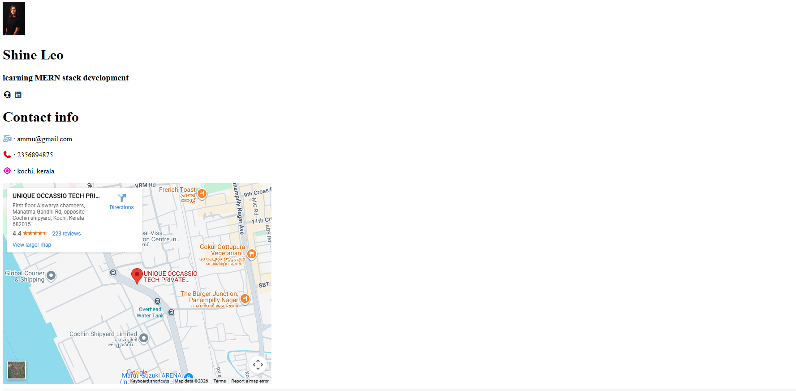
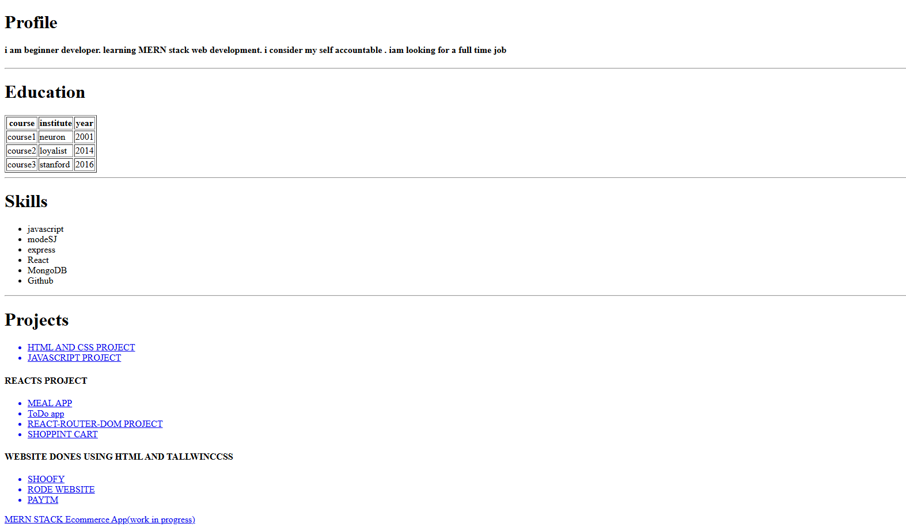

# Personal Portfolio

A personal portfolio website built using HTML to showcase my profile, technical skills, education, and projects as I progress in my web development journey.

## Overview

This project is a structured personal portfolio webpage designed to present:

* Professional profile summary
* Contact information
* Educational background
* Technical skills
* Project experience

The goal of this project is to practice core HTML fundamentals while building a clean and organized personal portfolio layout.

---

## Technologies Used

* **HTML5**
* **Font Awesome** (for icons)
* **Google Maps Embed API**

---

## Key Features

* Profile section with image and introduction
* Contact section with icons for better visual presentation
* Embedded Google Map location
* Education details displayed using a structured table
* Categorized project listings
* Clean semantic layout

---

## Sections Included

### Profile

Brief professional summary highlighting learning goals and career objectives.

### Contact Information

* Email
* Phone
* Location
* Map integration

### Education

Tabular representation of academic background.

### Technical Skills

* JavaScript
* Node.js
* Express.js
* React
* MongoDB
* Git & GitHub

### Projects

* HTML & CSS Projects
* JavaScript Projects
* React Applications
* Tailwind CSS Websites
* MERN Stack E-commerce Application (Work in Progress)

---

## Project Purpose

This portfolio was developed as part of my learning process in MERN Stack Development. It demonstrates foundational knowledge of HTML structure and webpage organization.

---

## Future Improvements

* Implement responsive design using CSS
* Improve UI/UX with modern styling
* Add functional project links
* Refactor using semantic HTML best practices
* Deploy the portfolio online (GitHub Pages / Netlify)

---

## Author

**Amritha Mohanan**
Aspiring web Developer
Kochi, Kerala

---
